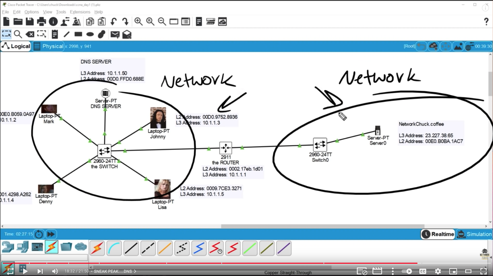

---
sources:
  - https://www.youtube.com/playlist?list=PLIhvC56v63IJVXv0GJcl9vO5Z6znCVb1P
---

# What is a network

| | OSI | TCP/IP |
|---|---|--|
| Layer 7 | Application | Application |
| Layer 6 | Presentation | |
| Layer 5 | Session | | 
| Layer 4 | Transport | Transport |
| Layer 3 | Network | Network |
| Layer 2 | Data Link | Data Link |
| Layer 1 | Physical | Physical | 

> Notice: the Application Layer 7 in both models - in TCP/IP (the widely used model), there is no layer 5 or 6.

From episode 0

---
## Switches 
- Switches are Layer 2 devices

from episode 1

---
## Routers
- Routers are Level 3 devices

from episode 2

---
## More about TCP/IP

HTTPS is an "Application layer protocol"

from episode 4

## Transport layer 

### TCP
- Reliable
- 3-way handshake (Syn, Syn Ack, Ack)
- Will try to send data over multiple times if the destination fails to acknowkledge reception
- Bad for real-time, because if a failure occurs, sending the data again is useless. Think about online gaming.

### UDP
- Fast
- Good for real-time stuff because it just sends and sends and sends and if some packets "miss", it just keeps going, doesn't care

 

